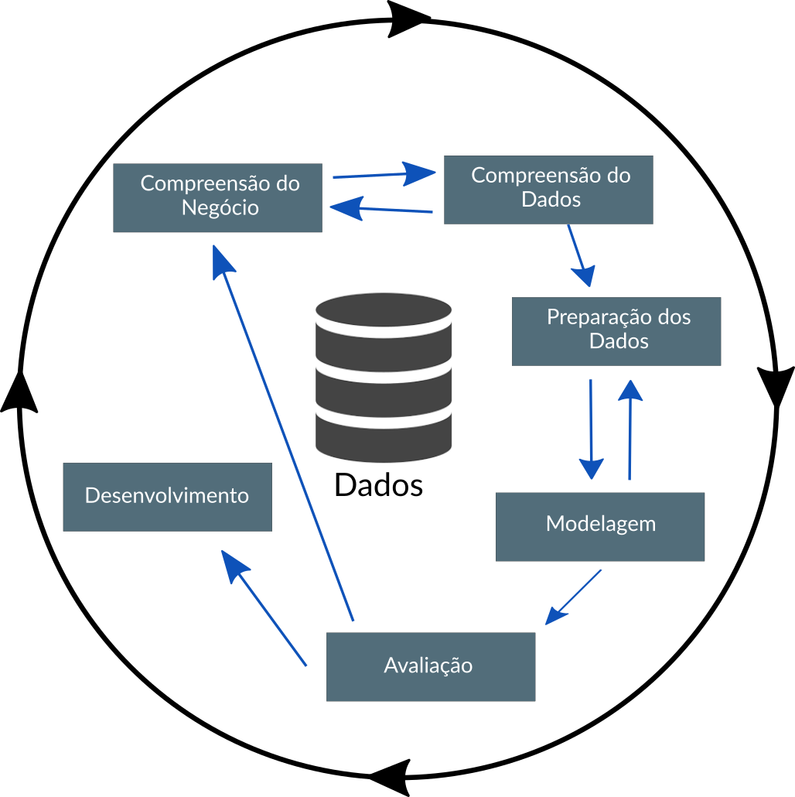
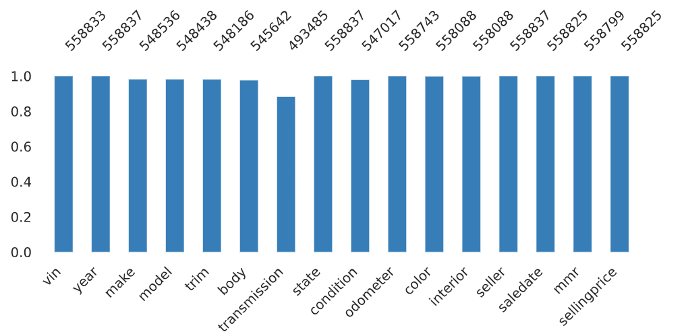
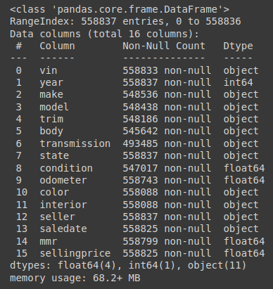
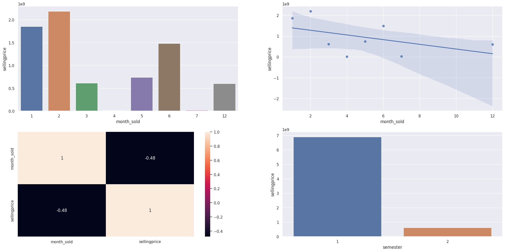
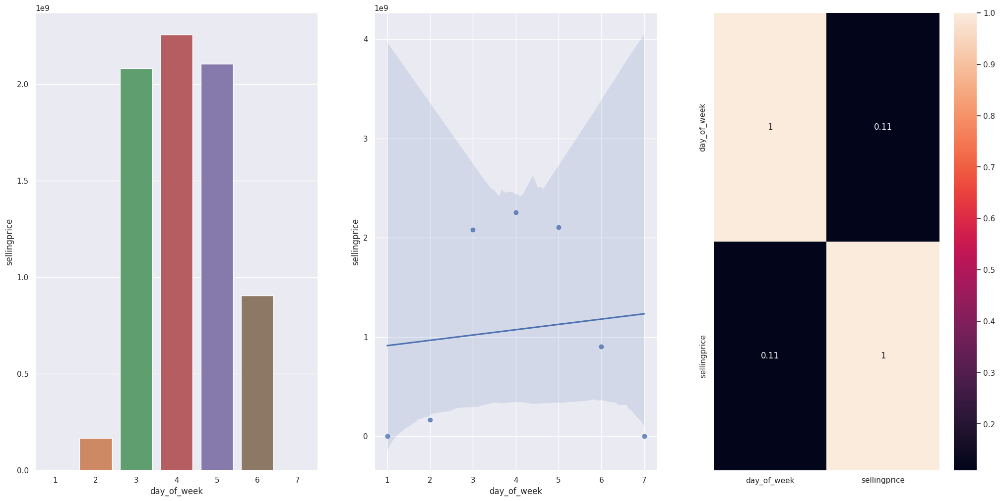
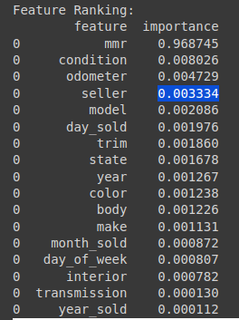
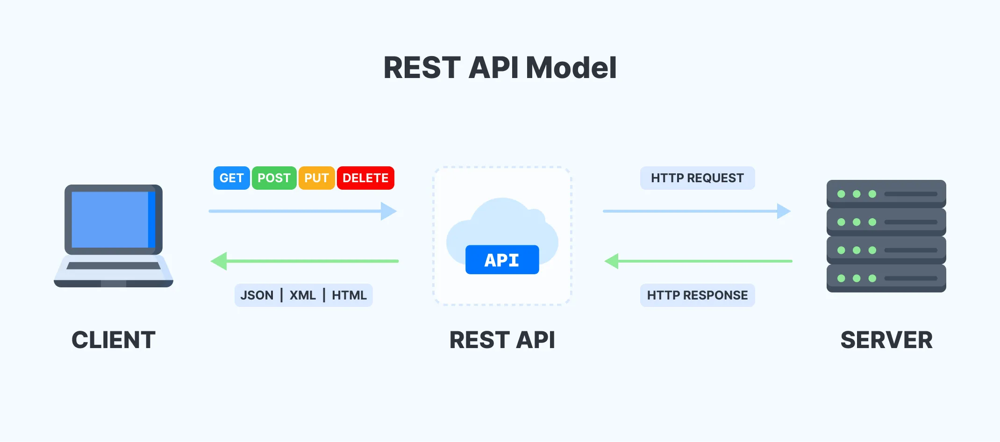

# Case de Negócios - Dasa (Cientista de Dados)

# 1.0 Previsão de Preço - Base de dados sobre Venda de Carros

---

## 1.1 Visão Geral do Modo de Solução

A metodologia usada para a resolução de um problema de negócio em análise de dados e aplicação de um modelo de machine learning parte do método *CRISP-DS(Cross Industry Standard Process for Data Science; SHEARER, 2000)*, um modelo organizacional de etapas  de desenvolvimento que atuam formando um ciclo, permitindo clareza e agilidade no alinhamento de expectativas e resultados em cada etapa.
A ideia quando da aplicação do CRIPS-DS é viabilizar a melhoria contínua da solução do problema de negócio. Ao término da iteração de cada ciclo, toma-se conhecimento de novos insights e otimização do ajuste de parâmetros, assim permitindo maior aprofundamento sobre o comportamento do negócio em estudo.

Figura 1 - Ilustração de um Ciclo do Modelo CRISP-DS

## 2.2 Descrição das Etapas do Ciclo com Contextualização para o Caso de Estudo

Descrevendo as etapas do ciclo proposto, temos:

1. **Compreensão do Negócio**
    
    A etapa inicial tem o objetivo de entender a dor provocada pelo problema de negócio, de forma a alinhar a expectativa de resolução com a necessidade real que o problema pede. É também nesta etapa que surgem os primeiros protótipos propostos como solução, a serem validados pelos stakeholders para posterior desenvolvimento.
    
    ***Contexto*** → No nosso Case de Estudo (Previsão de preço de vendas para carros), temos como objetivo criar um modelo de machine learning capaz de performar de forma otimizada.
    
    De posse da solução, times de negócio podem simular com maior clareza quais os fatores que mais influenciam no preço de venda, tomando vantagem nos negócios a partir de soluções adotadas a partir de dados (Data Driven).
    
    Ao término da aplicação do modelo, devemos responder às seguintes perguntas:
    
    1. Quais as características(features) que mais influenciam a alteração do preço do veículo ?
    2. Quais as premissas tomadas ao longo do processo de tratamento, análise de dados e feature engineering?
    3. Qual a performance do modelo aplicado e como expressar-los à times de negócio?
    4. Como colocar o modelo em produção?
    5. Quais são possíveis rotas para a melhoria contínua do modelo?
    
2. **Compreensão dos Dados**
    
    Compreende os processos de Extração, pré-processamento e validação de hipóteses dos dados.
    
    - A Extração é a etapa inicial da obtenção dos dados junto a seu banco administrador;
    - O pré-processamento refere-se às etapas de limpeza e identificação da natureza dos dados (Identificação de outliers, Natureza da distribuição de cada variável);
    - A Validação de Hipóteses visa compreender como as variáveis se relacionam, de forma a determinar através de insights acionáveis para o negócio e quais serão as variáveis a serem utilizadas para análise e aplicação em Modelos de Machine Learning.
    
    ***Contexto →*** Não houve extração de dados num banco de dados privado; o dataset usado para análise foi fornecido diretamente sob o formato de um arquivo .csv.
    
    ### Limpeza e Tratamento de Dados
    
    A primeira análise do dataset nos mostra uma base de dados com dados faltantes a serem tratados:
    
    
    
    Figura 2 - Representação gráfica da contagem total dos dados.
    
    De forma a entender estratégias para o preenchimento dos dados, faz-se necessário entender a informação e características gerais de cada coluna da base, tomando conhecimento do contexto do negócio ao qual a base de dados pertence. A saber:
    
    
    
    Figura 3 - Características gerais das variáveis preditoras.
    
    A descrição de cada coluna e as premissas adotadas para o preenchimento de dados faltantes, seguem:
    
    - vin: Código de identificação de veículo →  Coluna com o indicador de código de identificação do veículo 'vin', apresentava inconsistência para valores observados como 'automatic' no pandas profiling: Tais entradas foram corrigidas, assumindo transmissão como 'automática' e Estado de produção do veículo como 'ca' (Preenchimento por voto de maioria). Valores faltantes (NaN) tiveram suas linhas removidas.
    - year: Ano de Fabricação do Veículo
    - make: Montadora Fabricante do Veículo →Entradas com a coluna 'make' faltante (NaN), também apresentaram dados faltantes para demais características do carro (model, body, trim), sendo descartadas pela impossibilidade de ganho de informação.
    - model: Modelo do Veículo → Entradas faltantes para 'model' foram observadas para modelos que não fazem distinção de modelo/acabamento. Valores 'NaN' foram preenchidos com o nome do modelo, colocados inicialmente na coluna 'trim'.
    - trim: Versão de acabamento do véiculo → Modelos que não tem distinção de acabamento tiveram valores ausentes preenchidos com '-’
    - body: Categoria de carroceria do veículo → Modelos sem especificação de carroceria foram preenchidos com valor '-'.
    - transmission: Tipo de Transmissão → Valores faltantes preenchidos como 'automatic', por voto de maioria absoluta no dataset.
    - state: Estado onde o veículo foi fabricado
    - condition: Pontuação que expressa a condição do veículo (Valores de 0 a 50) → Os dados faltantes foram preenchidos com o score equivalente a mediana da base de dados encontradas pelo pandas profiling, que é o valor de 31.
    - odometer: Medição do Hodômetro indicado pelo veículo(Distância Percorrida) → Os dados faltantes foram preenchidos com o valor médio de distância percorrida das entradas presentes no dataset, que é o valor de 68320 milhas
    - color: Cor do Véiculo → Dados Faltantes preenchidos com '-'.
    - interior: Acabamento Interno → Dados faltantes preenchidos com '-'.
    - seller: Vendedor/Revendedora
    - saledate: Data de venda
    - mmr: (Manheim Market Report) - Valor de venda estimada para o veículo, estabelecido pela rede de casas de leilão Manheim, presente em todos os Estados dos EUA. → Linhas com valores faltantes removidas
    - sellingprice: Preço Vendido **(Váriavel alvo)**
    
    É importante notar que, exceto a alteração explicitada pela inconsistência dos dados nas colunas ‘vin’ (descritas acima), não foram observados outliers ou dados anormais na distribuição de cada coluna quando da aplicação da biblioteca pandas-profiling.
    
    ### Feature Engineering e Análise Exploratória de Dados
    
    O dataset devidamente tratado nos possibilita seguir com a testagem de hipóteses de forma a tentar obter insights visuais a respeito do comportamento das variáveis preditoras em correlação a variável alvo, além de posteriormente otimizar o funcionamento dos modelos de machine learning.
    
    É nessa etapa que visa-se otimizar o ganho de informação que um modelo de machine learning pode ter. Para que isso seja possível, é necessário fazer uma seleção de quais variáveis preditoras possuem maior relevância para a previsão da variável alvo.
    
    No contexto da nossa base de dados, a entrada ‘saledate’ foi desmembrada para colunas com valores de ‘day_of_week’, ‘day_sold’, ‘month_sold’, e ‘year_sold’, permitindo uma análise mais granular da relação das informações de data.
    
    As principais hipóteses/insights obtidos na análise exploratória de dados (EDA) foram:
    
    - **Veículos mais novos (ano de fabricação 2010 ou superior) são vendidos por preços em média 10% superiores (ou mais).**
        - *Verdadeiro →* As Plotagens e o mapa de calor mostram uma correlação positiva muito alta para carros fabricados após o ano de 2010
    
    
    
    Figura 4 - H1. Análise Bivariada entre year x sellingprice
    
    - **O Montante do valor em vendas é até 30% superior no segundo semestre (Meses de 6 a 12)**
        - *Falso*: Há uma disparidade muito grande entre o montante de vendas superior do primeiro semestre em comparação ao segundo. (Correlação negativa forte)
        
        
        
        Figura 5 - H6. Análise Bivariada entre month_sold x sellingprice
        
    - **O Montante do valor em vendas é em média até 20% superior aos finais de semana**
        - *Falso*: As vendas são considerávelmente maiores no meio da semana
    
    
    
    Figura 6 - H8. Análise Bivariada entre day_of_week x sellingprice
    
    ***Ferramentas →*** SQL e Gerenciadores de Banco de Dados(MySQL, Oracle, PostgreSQL, NoSQL, etc); Blibliotecas em Python para Manipulação de Dados Tabulares, Matrizes e funções matemáticas, criação de gráficos e visualizações de dados (Pandas, pandas-profiling, lux, Numpy, Matplotlib, Seaborn).
    
3. **Preparação dos Dados e Escolha final das Variáveis a aplicar no Modelo de machine Learning**
    
    Esta etapa tem como objetivo preparar os dados para que eles sejam utilizados pelos algoritmos de Machine Learning. É nesta etapa que são feitas as transformações nos dados (Exemplo: Encoding, Normalização, Padronização), a fim de facilitar o aprendizado do modelo de Machine Learning a ser aplicado.
    
    ***Contexto*** → Foram realizadas para as variáveis categóricas de nosso modelo o **Mean Target Encoding,** de forma a manter a proporção de cada categoria para a relação com a variável resposta.
    
    É então feita a separação da base de dados para datasets de treino e teste, com o propósito de evitar o **overfit,** ou seja, a adptação exagerada do modelo à base de dados (Baixo viés, alta variância), o que resulta em problemas de generalização para aplicação do modelo com dados inéditos.
    
    Por fim, foram aplicados os dados preparados e modelados num modelo de Floresta de Regressão, de forma a obter a listagem das variáveis que apresentam maior peso quando da otimização da função de custo para obtenção da previsão para a variável resposta.
    
    A ordenação das variáveis obtidas por esse modelo, foram:
    
    
    
    Figura 7 - Ranking de Features
    
    **IMPORTANTE:** A Feature 'mmr', por representar originalmente um valor de referência usado para negociação final de venda, possui valores observados próximos aos da nossa váriavel alvo 'sellingprice'. Tal proximidade de valores, reafirmada pela disparidade na importância da feature em comparação as demais quando da seleção para formação dos melhores 'ramos' das arvores da random forest podem ser um indicativo de **vazamento de dados**.
    
    Tal problema pode tornar o modelo mais otimista quando em treinamento, influenciando negativamente a sua capacidade de generalização.
    
    ***Ferramentas →*** Bibliotecas em Python para o tratamento de dados e aplicação de modelos de Machine Learning (Imblearn, Scikit-Learn).
    
4. **Modelagem**
    
    Esta etapa tem como objetivo selecionar e aplicar aos algoritmos de Machine Learning os dados preparados nas etapas anteriores. É nesta etapa que são selecionados os algoritmos  de treino e ,feito a comparação entre eles, seleciona-se aquele que obteve melhor performance como modelo final a ser usado nos testes da aplicação.
    
    ***Contexto →*** Através da análise feita via Análise Exploratória de Dados(EDA) e aplicação em modelo de Floresta de Regressão, foi definidas a lista de variáveis ('year', 'make', 'model', 'trim', 'body', 'state', 'condition', 'odometer', 'color', 'seller','month_sold', 'day_sold', 'mmr') a ser usada no modelo de previsão final desse ciclo de desenvolvimento.
    
    Foram comparadas as performances entre dois modelos baseados em florestas de Regressão:  Floresta de Regressão Padrão x XGBoost, de forma a observar o ganho de performance e generalização proporcionado pela sua diferença de funcionamento quanto a técnica e parâmetros de regularização presente no modelo
    
    Foi também definida uma função de validação cruzada, de forma a visar melhor confiabilidade nos resultados obtidos através do revezamento de partes do dataset ora como dados de treino, ora como dados de validação
    
    Os resultados, seguem:
    
    
    
    Figura 8 - Resultado Final do processo treino-validação do modelo
    
    Tomando como métrica de avaliação da regressão do modelo o MAPE (Mean Absolute Percentual Error), observamos que o XGBoost performa melhor com um erro de previsão de 19% em relação a variável alvo.
    
    ***Ferramentas →*** Bibliotecas em Python para o tratamento de dados e aplicação de modelos de Machine Learning (Imblearn, Scikit-Learn, xgboost).
    
5. **Avaliação dos Resultados**
    
    Etapa de testagem do modelo com dados inéditos (dataset de teste), e verificação de sua real capacidade de generalização.
    
    Objetiva verificar a performance do modelo treinado na etapa anterior para tradução das métricas observadas ao resultado de negócio, ou seja, o quanto a solução obtida trará de retorno financeiro.
    De acordo com os resultados obtidos, segue-se com a postagem do modelo final em produção.
    
    ***Ferramentas →*** Bibliotecas em Python para manipulação matemática (Numpy, Scipy)
    
6. **Postagem do Modelo em Produção (Desenvolvimento)**
    
    Esta etapa tem como objetivo publicar o algoritmo selecionado, tornando utilizável a solução criada.
    
    ***Ferramentas →*** Frameworks em Python para configuração e visualização de aplicações em API (Flask, Django, Streamlit); Softwares de DataViz (Power BI, Tableau); Aplicações em Nuvem (AWS, GCP, Azure).
    

## 2.3 Insights para melhoria contínua do modelo, sugestão de funcionamento em produção

Para além do ciclo inicial realizado para a resolução do case técnico, algumas ações podem ser tomadas pelo cientista de dados de forma a otimizar os resultados de um modelo de machine learning para previsão do valor de venda de carros encontrados no dataset de estudo, a saber:

1. **Feature Engineering →** De posse de mais informações sobre o negócios, novas features podem ser criadas objetivando acrescer ao ganho de informação do modelo.
Tais features podem ser valores inéditos (obtidos através de pesquisa, mineração de dados), ou agrupamentos de features já existente.
2. **EDA →** Pode ser realizada uma análise multivariada de dados, de forma a obter novos insights ou colunas acionáveis para aplicação no modelo.
3. **Modelagem (1)** → Podem ser testados modelos de machine learning com comportamento diferente aos de floresta de regressão (algoritmo não paramétrico), de forma a observar a capacidade de aprendizado e generalização de cada um para o dataset de estudo.
    - Possíveis exemplos envolvem modelos de machine learning baseados em algoritmos paramétricos, como por exemplo, Redes Neurais e Regressões (Logística, Polinomial, regularizada, etc).
4. **Modelagem (2)** → Aos modelos aplicados, também podem ser realizadas etapas de tunagem de hyperparâmetros, otimizando seu funcionamento para o dataset de estudo. 
Tal processo pode ser feito ou através da automatização por códigos/técnicas como Grid search, Random Search, ou mesmo através de bibliotecas/frameworks de otimização (Optuna).
5. **Postagem e Funcionamento do Modelo em Produção →** O Modelo de Machine Learning pode ser posto para funcionamento e visualizado através de funcionamento integrado com aplicações remotas. Alguns exemplos são:
    - Frameworks como Flask e Django permitem o desenvolvimento de sites, webapps, APIs, que fazem o intermédio da interação do usuário (cliente/time de negócio) com o modelo em funcionamento hospedado num servidor web (Render, Heroku),postado pelo desenvolvedor.
        
        
        
        Figura 9 - Arquitetura de funcionamento de um REST API
        
        - Pode-se ainda optar por integrar a requisição do modelo em funcionamento em um servidor remoto através de uma API já existente, como por exemplo, o Google Sheets. É possível fazer com que o google sheets receba dados do usuário e faça requisições em tempo real, simulando previsões diferentes.
    - Visualização dos Principais Insights obtidos de forma dinâmica pelo modelo através da postagem de um Dashboard em PowerBI ou através da construção de um webapp via framework streamlit.